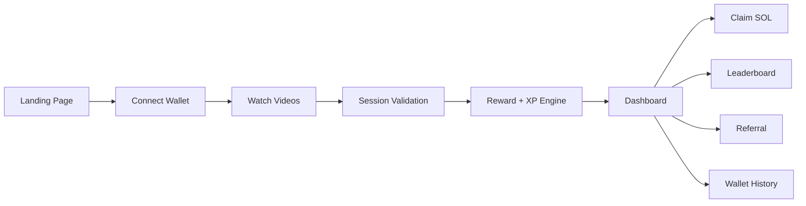
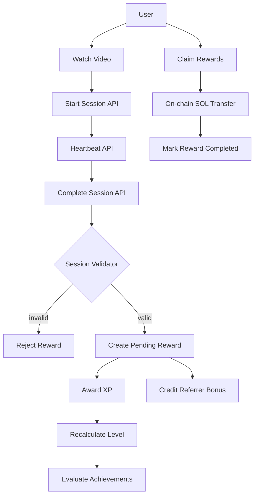
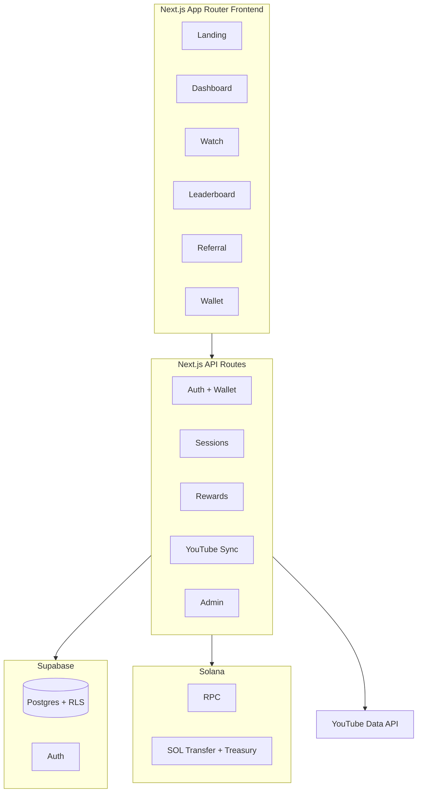
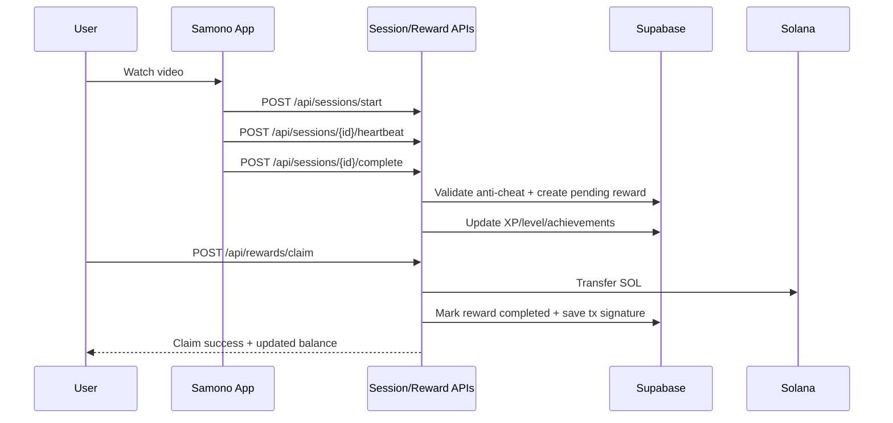

# Samono

Samono is a watch-to-earn protocol on Solana.
Users watch curated videos, complete validated watch sessions, earn points/XP, and claim SOL rewards.

## Who We Are

Samono is building a creator-viewer economy where attention is rewarded transparently.
Instead of closed loyalty systems, rewards are verifiable and tied to on-chain settlement.

## Why We Exist

Most content platforms capture viewer value while giving users no direct upside.
Samono flips that model:

- Viewers earn for meaningful engagement
- Creators get a growth loop through referrals and retention mechanics
- Reward distribution is auditable and anti-abuse validated

## What The App Does

- Wallet-based onboarding (Phantom, Solflare, Wallet Standard)
- YouTube video ingestion (channel + playlist sync)
- Session tracking with anti-cheat validation
- Reward calculation with streak/level/referral multipliers
- Claim pipeline to distribute SOL to user wallets
- XP, levels, achievements, referrals, leaderboard

## Social Links

- Website: https://samono.com
- App subdomain: https://apps.samono.com
- YouTube channel (configured default source): https://www.youtube.com/channel/UCd_2mFYfC0V4tPjI2EKCxKw
- Featured video used in landing preview: https://www.youtube.com/watch?v=v1ZQlVMlG2c
- X (Twitter): https://x.com/rakaalts

## Product Preview And Flow



## How It Works



## Architecture



## Reward Lifecycle



## Core Features

- Watch-to-earn loop with session integrity checks
- XP progression and tiered levels
- Achievement unlock system
- Referral program (10% bonus)
- Leaderboard based on user performance
- Wallet connection history + reward claim history
- YouTube sync pipeline for video catalog updates

## Anti-Abuse Rules

Session validation includes checks for:

- Minimum watch percentage
- Excessive tab switching
- Playback speed manipulation
- Low active-watch ratio
- Daily session caps
- Duplicate reward protection

## Tech Stack

- Frontend: Next.js 16, React 19, Tailwind CSS 4, shadcn/ui
- Auth + DB: Supabase Auth + Postgres + RLS
- Blockchain: Solana + SPL tooling + Anchor dependencies
- Wallets: Solana Wallet Adapter (Phantom, Solflare, Wallet Standard)
- Video source: YouTube Data API

## App Routes (Pages)

- `/` landing
- `/dashboard` user hub
- `/watch` watch index
- `/watch/[videoId]` player/session page
- `/leaderboard` rankings
- `/referral` referral center
- `/wallet` claim + history
- `/profile/[username]` public profile
- `/(auth)/login` and `/(auth)/register`

## API Routes

- `GET/POST /api/videos`
- `POST /api/videos/sync`
- `POST /api/sessions/start`
- `POST /api/sessions/[sessionId]/heartbeat`
- `POST /api/sessions/[sessionId]/complete`
- `GET /api/rewards/balance`
- `POST /api/rewards/claim`
- `POST /api/rewards/swap`
- `GET /api/leaderboard`
- `GET /api/referral`
- `POST /api/wallet/connect`
- `POST /api/auth/wallet`
- `POST /api/auth/complete-registration`
- `POST /api/waitlist`
- `GET /api/cron/sync-youtube`
- Admin: `/api/admin/videos`, `/api/admin/videos/sync`, `/api/admin/debug-env`

## Data Model (Supabase)

Main tables:

- `profiles`
- `videos`
- `watch_sessions`
- `rewards`
- `wallet_connections`
- `achievements`
- `user_achievements`

Notable DB behavior:

- Auto profile creation on auth signup
- Automatic streak updates from completed sessions
- Automatic `total_earned` update when rewards complete
- Video reward points auto-derived from video duration

## Environment Variables

Use `.env.example` as baseline.

- `NEXT_PUBLIC_SUPABASE_URL`
- `NEXT_PUBLIC_SUPABASE_ANON_KEY`
- `SUPABASE_SERVICE_ROLE_KEY`
- `SOLANA_RPC_URL`
- `SMT_MINT_ADDRESS`
- `TREASURY_WALLET_PATH`
- `YOUTUBE_API_KEY`
- `NEXT_PUBLIC_YOUTUBE_CHANNEL_ID`
- `YOUTUBE_PLAYLIST_ID`

## Local Development

```bash
npm install
npm run dev
```

Open http://localhost:3000

Useful scripts:

- `npm run dev` start local app
- `npm run build` production build
- `npm run start` run production server
- `npm run lint` lint project
- `npm run deploy:token` run SPL token deploy script

## Authentication Model

- Supabase Auth for account/session management
- Middleware route guards for app pages
- Wallet connection is required for claiming rewards

## Current Status

Samono is structured as a production-style full-stack app with watch session validation, gamification engines, and on-chain payout integration.

