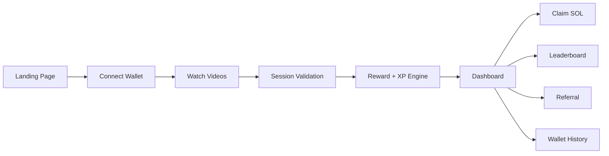
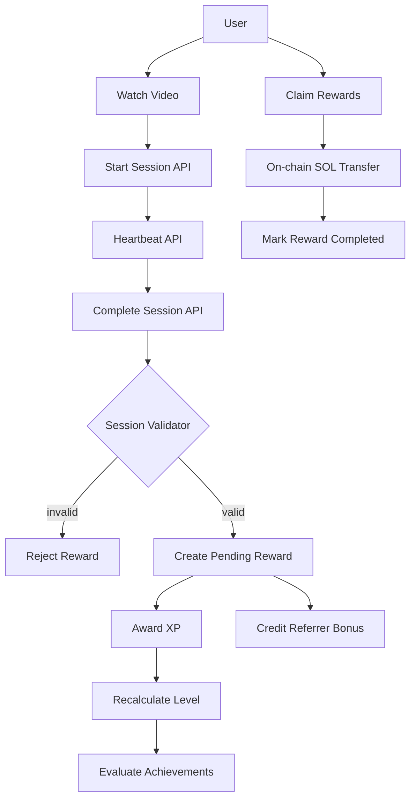
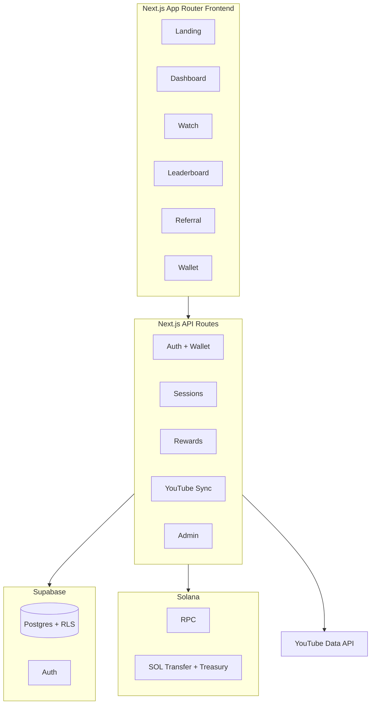
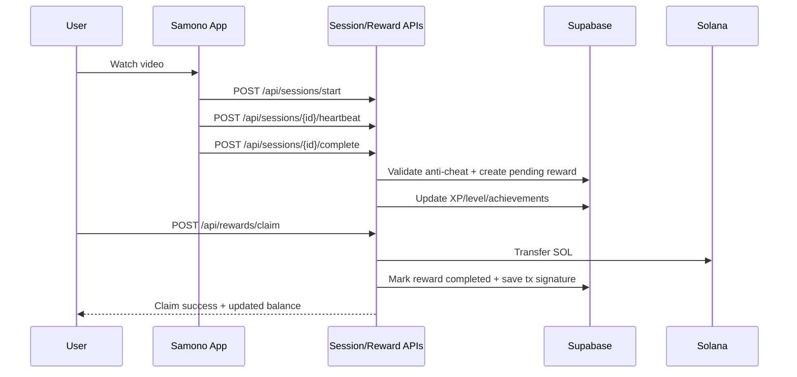

# Samono

Samono is a watch-to-earn protocol on Solana.
Users watch curated videos, complete validated watch sessions, earn points/XP, and claim SOL rewards.

## Who We Are

Samono is building a creator-viewer economy where attention is rewarded transparently.
Instead of closed loyalty systems, rewards are verifiable and tied to on-chain settlement.

## Why We Exist

Most content platforms capture viewer value while giving users no direct upside.
Samono flips that model:

- Viewers earn for meaningful engagement
- Creators get a growth loop through referrals and retention mechanics
- Reward distribution is auditable and anti-abuse validated

## What The App Does

- Wallet-based onboarding (Phantom, Solflare, Wallet Standard)
- YouTube video ingestion (channel + playlist sync)
- Session tracking with anti-cheat validation
- Reward calculation with streak/level/referral multipliers
- Claim pipeline to distribute SOL to user wallets
- XP, levels, achievements, referrals, leaderboard

## Social Links

- Website: https://samono.com
- App subdomain: https://apps.samono.com
- YouTube channel (configured default source): https://www.youtube.com/channel/UCd_2mFYfC0V4tPjI2EKCxKw
- Featured video used in landing preview: https://www.youtube.com/watch?v=v1ZQlVMlG2c
- X (Twitter): https://x.com/samonoonchain

## On-Chain Contracts

### Treasury & Swap Program (Solana)

**Program ID:** `8L2w36BLr8NdPaEkXTRiUaM9jXM7nSQYdM8EDKhoPAFh`

- **Devnet:** [View on Solana Explorer (Devnet)](https://explorer.solana.com/address/8L2w36BLr8NdPaEkXTRiUaM9jXM7nSQYdM8EDKhoPAFh?cluster=devnet)
- **Mainnet:** Will be published upon mainnet deployment

**Treasury PDA** (Derived from seed `"treasury"` + Program ID):
- **Address:** `EXJUqE9J7e3RfBcFbQ8N7c3fXrXvF2jhC5MvNzcG2rQ8` (on Devnet)
- **Devnet:** [View on Solana Explorer (Devnet)](https://explorer.solana.com/address/EXJUqE9J7e3RfBcFbQ8N7c3fXrXvF2jhC5MvNzcG2rQ8?cluster=devnet)
- **Holds:** SOL rewards for user claims, funded via the admin keypair

**Token (SMT):**
- Program address will be published upon mainnet deployment, currently using a devnet $SOL test token for development and testing purposes.

## Product Preview And Flow



## How It Works



## Architecture



## Reward Lifecycle



## Core Features

- Watch-to-earn loop with session integrity checks
- XP progression and tiered levels
- Achievement unlock system
- Referral program (10% bonus)
- Leaderboard based on user performance
- Wallet connection history + reward claim history
- YouTube sync pipeline for video catalog updates

## Anti-Abuse Rules

Session validation includes checks for:

- Minimum watch percentage
- Excessive tab switching
- Playback speed manipulation
- Low active-watch ratio
- Daily session caps
- Duplicate reward protection

## Tech Stack

- Frontend: Next.js 16, React 19, Tailwind CSS 4, shadcn/ui
- Auth + DB: Supabase Auth + Postgres + RLS
- Blockchain: Solana + SPL tooling + Anchor dependencies
- Wallets: Solana Wallet Adapter (Phantom, Solflare, Wallet Standard)
- Video source: YouTube Data API

## App Routes (Pages)

- `/` landing
- `/dashboard` user hub
- `/watch` watch index
- `/watch/[videoId]` player/session page
- `/leaderboard` rankings
- `/referral` referral center
- `/wallet` claim + history
- `/profile/[username]` public profile
- `/(auth)/login` and `/(auth)/register`

## API Surface (Sanitized)

For security reasons, this README documents API capabilities at a high level without exposing operational secrets or internal privileged logic.

- Auth and wallet:
	- wallet sign-in / linking
	- registration completion
- Video and ingestion:
	- read video catalog
	- manual/admin sync from YouTube source
	- scheduled sync endpoint for cron
- Sessions:
	- start watch session
	- heartbeat telemetry updates
	- complete session and trigger validation
- Rewards:
	- check pending/claimable balance
	- claim rewards to connected wallet
	- points/swap-related reward action
- Growth:
	- referral stats and attribution
	- leaderboard query
	- waitlist capture endpoint

## Database Model (Sanitized)

Core entities used by the app:

- Profiles: identity, username, wallet, progression, earnings
- Videos: YouTube metadata and reward config
- Watch sessions: anti-abuse telemetry + session state
- Rewards: pending/processing/completed claim records
- Wallet connections: linked wallet history per user
- Achievements and user achievements: gamification rules and unlock records

Security and integrity controls:

- Row Level Security (RLS) for user-scoped data access
- Trigger-based consistency updates for totals/streak/profiles
- Unique constraints to prevent duplicate reward claims

## Environment And Secret Policy

This repository uses env placeholders only. Real values are never committed.

Environment groups:

- Public client config (frontend + API):
	- Supabase URL
	- Supabase anon key
- Server secrets (API routes, server-side logic):
	- Supabase service role key
	- YouTube API key
	- Solana treasury and RPC settings

Operational policy:

- Secrets are injected through deployment/runtime environment
- Private keys and service-role credentials are excluded from version control
- Public docs intentionally redact sensitive infrastructure details

## Security Disclosure Note

Some endpoint, infrastructure, and environment details are intentionally summarized (not fully enumerated) to balance technical transparency with production security.

This is deliberate and part of Samono's secure-by-default documentation standard.

## Local Development

```bash
npm install
npm run dev
```

Open http://localhost:3000

Useful scripts:

- `npm run dev` start local app
- `npm run build` production build
- `npm run start` run production server
- `npm run lint` lint project
- `npm run deploy:token` run SPL token deploy script

## Current Status

Samono is structured as a production-style full-stack app with watch session validation, gamification engines, and on-chain payout integration.

